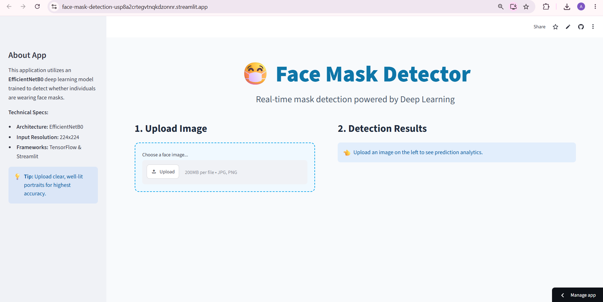
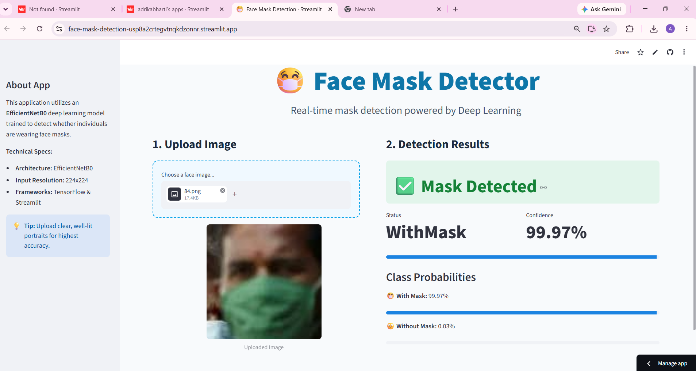

# 😷 Face Mask Detection

A deep learning-based image classification system that detects whether a person is **wearing a face mask or not**. The project uses **EfficientNetB0 transfer learning** with TensorFlow/Keras and provides an interactive web interface using **Streamlit**.

🔗 **Live Demo:** [Add your Streamlit Cloud link here](#)

---

## 📌 Overview

Face Mask Detection is a computer vision project designed to classify facial images into two categories:

- 😷 **WithMask**
- 🙂 **WithoutMask**

The system uses **EfficientNetB0**, a pretrained convolutional neural network, as the feature extraction backbone. The pretrained layers are frozen and additional fully connected layers are added for image classification.

Users can upload a face image through the Streamlit web application, and the system predicts whether the person is wearing a mask along with the prediction result.

---

## 📊 Dataset

The dataset contains **10,992 validated images** belonging to two classes.

| Dataset | Images |
|---|---:|
| Training | 10,000 |
| Validation | 595 |
| Testing | 397 |
| **Total** | **10,992** |

### Classes

- `WithMask`
- `WithoutMask`

### Test Set Distribution

| Class | Images |
|---|---:|
| WithMask | 201 |
| WithoutMask | 196 |
| **Total** | **397** |

---

## 🧠 Model Architecture

The project uses **transfer learning with EfficientNetB0 pretrained on ImageNet**.

### Architecture

```text
Input Image
     │
     ▼
224 × 224 × 3
     │
     ▼
EfficientNetB0
(ImageNet Pretrained)
     │
     ▼
Batch Normalization
     │
     ▼
Dense Layer
256 Neurons
     │
     ▼
Dropout
     │
     ▼
Dense Layer
2 Neurons
     │
     ▼
Softmax
     │
     ▼
WithMask / WithoutMask

### Model Details

| Component                | Details                                              |
| ------------------------ | ---------------------------------------------------- |
| Base Model               | EfficientNetB0                                       |
| Pretrained Weights       | ImageNet                                             |
| Input Size               | 224 × 224 × 3                                        |
| Classification Layers    | BatchNormalization → Dense(256) → Dropout → Dense(2) |
| Output Activation        | Softmax                                              |
| Total Parameters         | 4,383,141                                            |
| Trainable Parameters     | 331,010                                              |
| Non-trainable Parameters | 4,052,131                                            |

The EfficientNetB0 backbone was frozen during training, while the additional classification layers were trained.

---

## ⚙️ Training Configuration

| Parameter         | Value                    |
| ----------------- | ------------------------ |
| Framework         | TensorFlow / Keras       |
| Optimizer         | Adamax                   |
| Learning Rate     | 0.0005                   |
| Configured Epochs | 20                       |
| Epochs Completed  | 4                        |
| Input Size        | 224 × 224                |
| Batch Size        | 16                       |
| Loss Function     | Categorical Crossentropy |
| Output Classes    | 2                        |

### Data Augmentation

The training dataset was augmented using:

* Rotation
* Width shifting
* Height shifting
* Shearing
* Zooming
* Horizontal flipping

Data augmentation helps improve the model's ability to generalize to variations in face orientation and image conditions.

---

## 📈 Results

The model achieved excellent performance on the training, validation, and test datasets.

### Accuracy

| Dataset    |   Accuracy |
| ---------- | ---------: |
| Training   | **99.45%** |
| Validation | **99.33%** |
| Test       | **99.50%** |

### Loss

| Dataset    |   Loss |
| ---------- | -----: |
| Training   | 0.0145 |
| Validation | 0.0190 |
| Test       | 0.0104 |

### Classification Report

| Class        | Precision | Recall | F1-Score | Support |
| ------------ | --------: | -----: | -------: | ------: |
| WithMask     |      1.00 |   0.99 |     0.99 |     201 |
| WithoutMask  |      0.99 |   1.00 |     0.99 |     196 |
| **Accuracy** |           |        | **0.99** | **397** |
| Macro Avg    |      0.99 |   1.00 |     0.99 |     397 |
| Weighted Avg |      1.00 |   0.99 |     0.99 |     397 |

### 🎯 Final Test Accuracy: 99.50%

The model correctly classified approximately **99.5% of the 397 test images**.

---

## 📉 Training Performance

The model achieved high accuracy throughout the training process.

| Epoch | Training Accuracy | Validation Accuracy |
| ----- | ----------------: | ------------------: |
| 1     |            97.36% |              98.99% |
| 2     |            98.29% |              99.33% |
| 3     |            98.46% |              99.33% |
| 4     |            98.53% |              99.16% |

The validation accuracy remained above **98% throughout training**, reaching a maximum of approximately **99.33%**.

---

## 🖥️ Web Application

The trained model is integrated into an interactive **Streamlit web application**.

The application allows users to:

1. Upload a face image.
2. Process the uploaded image.
3. Run the trained deep learning model.
4. Predict whether the person is wearing a mask.
5. Display the prediction result.

### Example Prediction

```text
Prediction: WithoutMask
```

---

## 🛠️ Tech Stack

### Machine Learning & Deep Learning

* Python
* TensorFlow
* Keras
* EfficientNetB0
* NumPy

### Web Application

* Streamlit
* Pillow (PIL)

### Development Tools

* Git
* GitHub

### Deployment

* Streamlit Cloud

---

## 📁 Project Structure

```text
Face--Mask-Detection_1/
│
├── train_model.py
│   └── Model training and evaluation
│
├── face_mask_model.h5
│   └── Trained EfficientNetB0 model
│
├── app.py
│   └── Streamlit web application
│
├── requirements.txt
│   └── Python dependencies
│
├── Project_document.pdf
│   └── Detailed project documentation
│
├── screenshots/
│   ├── home.png
│   └── prediction.png
│
│── charts/
│   ├── bar_chart.png
│   └── training_history.png
│   ├── sample_images.png
│   └── confusion_matrix.png
├   ├── heatmap.png
│   └── histogram.png
│   ├── piechart.png
│   └── classfication_report.txt
│
|
└── README.md
```

### File Description

| File                   | Description                             |
| ---------------------- | --------------------------------------- |
| `train_model.py`    | Model training, evaluation and analysis |
| `face_mask_model.h5`   | Saved trained model                     |
| `app.py`               | Streamlit application for prediction    |
| `requirements.txt`     | Required Python dependencies            |
| `screenshots/`         | Application screenshots                 |
| `README.md`            | Project documentation                   |

---

## 🚀 How to Run Locally

### 1. Clone the Repository

```bash
git clone https://github.com/AdrikaBharti/Face--Mask-Detection_1.git
```

### 2. Navigate to the Project Directory

```bash
cd Face--Mask-Detection_1
```

### 3. Install Dependencies

```bash
pip install -r requirements.txt
```

### 4. Run the Streamlit Application

```bash
streamlit run app.py
```

### 5. Open the Application

After running the command, open the following URL in your browser:

```text
http://localhost:8501
```

Upload a face image to get the mask detection prediction.

---

## 📸 Screenshots

### Home Page



### Prediction Result




---

## 🌐 Live Demo

🚀 **Streamlit Application:** [Click here to try the live demo](#)


---

## 🔮 Future Developments

* Add **real-time webcam-based mask detection**
* Detect and classify **multiple faces** in a single image
* Add a dedicated **face detection** stage before classification
* Fine-tune the upper layers of EfficientNetB0
* Train the model on a larger and more diverse dataset
* Improve performance under different lighting conditions
* Optimize the model for faster real-time inference
* Add prediction history and analytics
* Develop a mobile-friendly version
* Deploy the model on additional cloud platforms

---

## ⚠️ Limitations

* The current application works with uploaded images rather than live video.
* Performance may vary depending on image quality and lighting conditions.
* The dataset may not represent every real-world scenario.
* The current model is primarily intended for educational and demonstration purposes.

---

## 👩‍💻 Author

**Adrika Bharti**

🔗 [GitHub](https://github.com/AdrikaBharti)

🔗 [LinkedIn](https://linkedin.com/in/adrika-bharti-15b354292)

---

## 📄 License

This project is created for **educational and learning purposes**.

````
